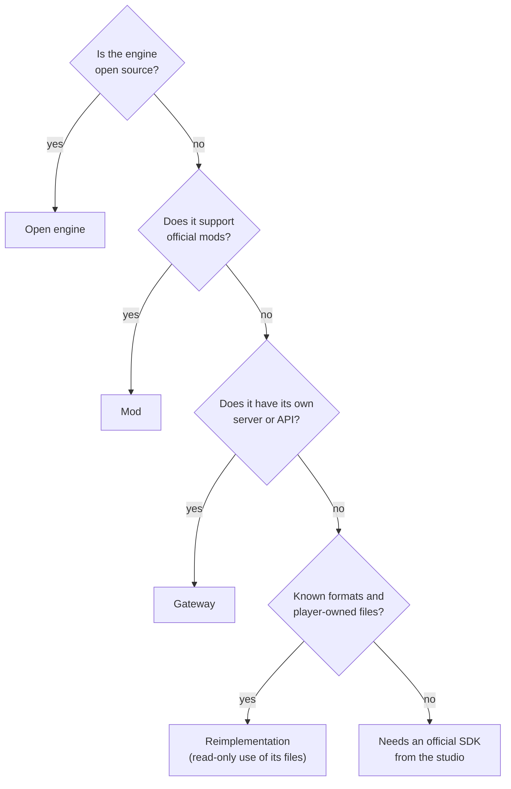

import { Callout } from 'nextra/components'

# Integration modes

How a translator connects to its game depends on how open the game is. There are four paths, and all of them are legitimate:

| Mode | When | Beta example | Advantage | Cost |
|---|---|---|---|---|
| **Gateway** | The game has its own server, console or API | Minecraft: official server + RCON | Uses the original client untouched | Extra latency; limited to what the API exposes |
| **Open engine** | The engine is open source | ioquake3 / OpenArena *(planned)* | Deep, native integration | You maintain a fork |
| **Mod** | The game supports official mods | Unturned, Garry's Mod *(planned)* | Ships like any other mod | Depends on the mod API |
| **Reimplementation** | File formats are known and the player owns the files | Doom and OpenArena viewers | Full control; never touches the game | Rendering and sound must be rebuilt |

<Callout type="error">
**What we do not do:** inject code into online games, bypass anti-cheat, modify official servers or redistribute a game's files. If a game can only be integrated that way, the path is to propose it to its studio. See [principles and legal](/legal/).
</Callout>
