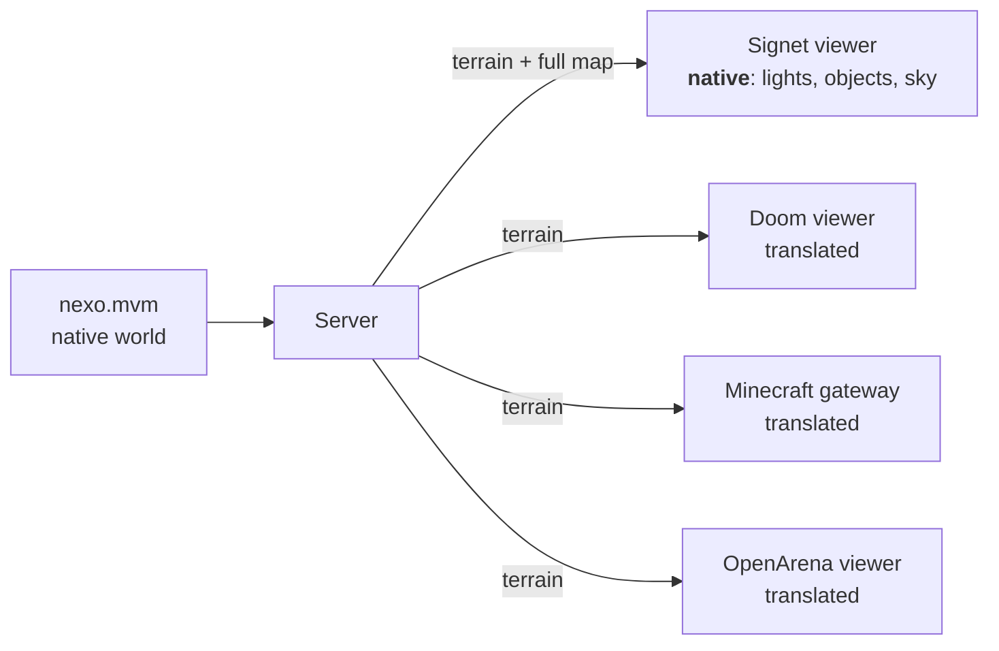

import { Callout, Steps, Tabs } from 'nextra/components'

# Native worlds

Doom or OpenArena worlds reach Signet through an **importer**, and something is lost on the way: the neutral terrain only has heights, ceilings and materials. A **native world** is written directly for Signet (`fuente = "signet:<id>"`) and keeps more:

| What it has | Neutral terrain | Native world |
|---|---|---|
| Floors, ceilings, walls, materials | ✅ | ✅ |
| Coloured lights (position, colour, intensity, range) | baked light per cell only | ✅ |
| Objects (columns, crystals, lamps, arches, crates…) | become walls if solid | ✅ |
| Sky (zenith and horizon colours) and ambient light | — | ✅ |
| Author and license | — | ✅ |

## Native for us, translated for everyone else

Because a native world is open content made for Signet, the server sends it **in full** in the welcome message, in the optional `Bienvenida.mapa` field:



- The **Signet viewer** (F6 in the reference client) draws the map with every detail: real lights, 3D objects, a gradient sky and materials with glowing seams.
- **Everyone else** receives the map projected onto the neutral terrain and translates it like any other world. A solid object becomes a wall: the crystal at the centre of Nexo is a computer panel in Doom and a deepslate pillar in Minecraft.

Older translators ignore the `mapa` field, so nothing needs to change for a native world to work in them. Servers also accept the legacy prefix `multiverso:` used by the first betas.

## Nexo, the first native world


Nexo is 40 × 40 m and ships with the SDK (`mundo::incluido("nexo")`):

- **Centre:** a plaza open to the sky, with a dais and the Nexo crystal.
- **North:** a stone temple with a raised altar and four columns.
- **South:** a laboratory with a toxic channel and crates.
- **West:** an open-air garden with a pond and lamps.
- **East:** a metal hangar with a walkway at 3 m.
- Metal corridors and a wooden ring connect the rooms. It has 8 spawn points, 18 lights and 18 objects.


```bash
# server
docker run -d --name signet -p 7777:7777 -e SIGNET_WORLD=signet:nexo signet-server
# offline preview in the reference client (prototype binary `multiverso`)
multiverso vista signet signet:nexo
```

## Writing a native world

<Tabs items={['.mvm format (by hand)', 'In code (Rust)']}>
  <Tabs.Tab>
    An `.mvm` file is plain text: a header, three ASCII layers of `side × side` characters, and a list of lights, objects and spawn points. Read it with `Mapa::desde_mvm`. Keywords are Spanish, like the rest of the Signet/1 vocabulary.

    ```text filename="my_world.mvm"
    mapa patio                     # id
    nombre Patio                   # name
    autor Your name                # author
    licencia CC0-1.0               # license
    lado 8                         # side
    cielo 22 24 58  150 92 210     # sky: zenith (r g b) and horizon (r g b)
    ambiente 0.3                   # ambient light

    leyenda a core:pared           # legend: letter → material
    leyenda b core:piedra
    leyenda c core:agua

    suelo                          # floor: '#' wall · '0'–'9' and 'a'–'z' = height 0–35
    ########
    #111111#
    #100001#
    #100001#
    #111221#
    #111221#
    #111111#
    ########
    fin
    techo                          # ceiling: '.' sky · digit = ceiling height
    ########
    #......#
    #......#
    #......#
    #444444#
    #444444#
    #444444#
    ########
    fin
    material                       # one legend letter per cell (walls included)
    aaaaaaaa
    abbbbbba
    abccccba
    abccccba
    abbbbbba
    abbbbbba
    abbbbbba
    aaaaaaaa
    fin

    luz 4 5 3  255 200 140  0.8 8          # light: x z height-above-floor  r g b  intensity range
    objeto farola 1.5 1.5 3  255 210 150 solido   # object: type x z height  r g b  [solido = solid]
    aparicion 1.5 6.5                      # spawn point
    ```

    Positions are in cells from the north-west corner: `4.5 6.5` is the centre of the cell in column 4, row 6. This exact example is part of the SDK's test suite.
  </Tabs.Tab>
  <Tabs.Tab>
    ```rust
    use signet_sdk::mundo::ConstructorMapa;

    let mut c = ConstructorMapa::nuevo("patio", "Patio", 24);
    c.autor("Your name", "CC0-1.0").cielo([22, 24, 58], [150, 92, 210], 0.3);
    let stone = c.material("core:piedra");
    let metal = c.material("core:metal");
    c.sala(2, 2, 21, 21, 1, None, stone);                     // courtyard open to the sky
    c.sala(2, 14, 21, 21, 1, Some(5), metal);                 // covered hall
    c.escalera(10, 8, 13, 11, 1, 3, false, None, stone);      // stairs up to 3 m
    c.objeto("cristal", 12.0, 5.0, 3.0, [176, 120, 255], true);
    c.luz(12.0, 5.0, 4.0, [170, 110, 255], 1.5, 14.0);
    c.aparicion(4.5, 4.5).aparicion(19.5, 19.5);
    let map = c.construir();
    std::fs::write("patio.mvm", map.a_mvm()).unwrap();
    ```
    `sala` = room, `escalera` = stairs, `objeto` = object, `luz` = light, `aparicion` = spawn point. Nexo is built this way: `cargo run --example crear_nexo`.
  </Tabs.Tab>
</Tabs>

<Steps>

### Check conformance

`map.a_terreno()` must pass T01–T07 and R01–R02. The `crear_nexo` example checks it before saving.

### Object types

Signet viewers know `columna` (column), `cristal` (crystal), `farola` (lamp), `arco` (arch) and `caja` (crate). Unknown types are drawn as a crate, so you can invent new types without breaking anything.

### Share your world

Native worlds are added to the SDK (`mundos/*.mvm`) through a PR, under an open license (CC0 or CC-BY). That way every server can host them and every client can see them natively.

</Steps>

<Callout type="info">
**Why a format of our own?** For the same reason Doom (WAD) and Quake (BSP) have native formats: it is what the engine understands without loss. The difference is that this format is designed from the start to be translated into every other game.
</Callout>
