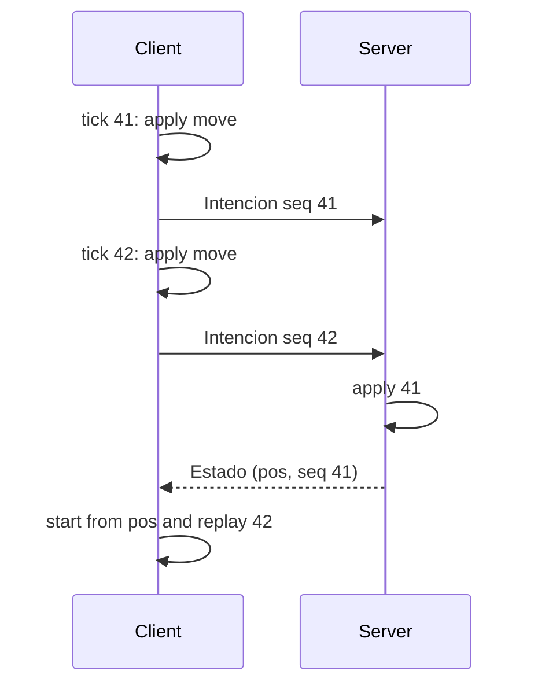

import { Callout, Steps } from 'nextra/components'

# Authority and networking

## The server is in charge

Clients **do not say where they are**; they say **what they want to do**: move, turn, fire, switch weapons. The server applies the game mode's rules and decides positions, hits, damage and deaths. That way a modified client cannot teleport or deal more damage, and everyone sees the same match.

## Prediction with numbered commands

Waiting for the server before moving would be noticeable: with a 50 ms ping, every step would arrive late. So the client **predicts** its own movement with the same rules. To keep prediction and server from drifting apart, Signet uses the same scheme as Quake III:

<Steps>

### One command per tick

The simulation advances in fixed ticks of **1/20 s**. On every tick the client creates a numbered command (`Intencion.seq = 1, 2, 3…`), applies it locally and sends it.

### The server applies each command once

The server queues the commands and applies each one **exactly once**, at most 3 per tick (so it catches up if the network bundles them, but nobody moves faster). In every snapshot it returns `JugadorNet.seq`: the last command it applied.

### The client reconciles

When the snapshot arrives, the client starts from the server's position and **re-applies** the commands that are not confirmed yet. With the same rules and the same commands, the result matches what it had already predicted and nothing is noticeable.

### Interpolation

What gets drawn is interpolated between the states before and after the latest command, so movement looks smooth even though the simulation runs at 20 Hz.

</Steps>

<Callout type="info">
In the Rust SDK, `Prediccion` does all of this, and `Cliente::avanzar(dt)` wraps it. In C it is `sg_advance`. Your engine only sets the intent and draws where it is told.
</Callout>

## Sub-steps: why step size matters

The step rule ("never climb more than 1 m at once") is measured from the previous step. If the server moved 0.9 m per tick and the client 6 cm per frame, one would climb a staircase and the other would stay at the bottom. That is why `mover` splits every tick into **sub-steps of at most 10 cm**: the result does not depend on who simulates or at what rate.

We measured it on `oa_dm1`. Before this change, in 20 % of the test runs client and server ended more than 2.5 m apart. With sub-steps and numbered commands, a real session of 800 commands against the server produced **0 corrections**.

## Debugging synchronisation

`Cliente::desincronia()` (in C, `sg_corrections`) reports:

- the server's position and the predicted one,
- the last command sent and the last one confirmed (the difference × 50 ms ≈ ping),
- the error at each confirmation, the maximum and the latest corrections.

The reference client shows it in a minimap with the **M** key: a blue dot for the server and a green one for the prediction.

## Compatibility

An `Intencion` without `seq` (or with `seq = 0`) still works: the server applies the latest intent every tick, as older adapters did and as the Minecraft gateway does today. If a client detects that the server never confirms commands, it only predicts a few ticks ahead.
