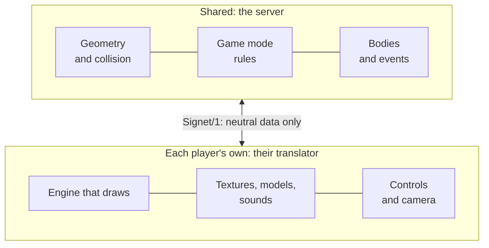

import { Callout } from 'nextra/components'

# The principle: every game compatible

Today two people can only play together if they own **the same game**. Crossplay joins platforms (PC, console, mobile), but it is still a single game. Signet Protocol proposes something else: that **different games** share the same world and the same match.

## The key idea: separate what is shared from what is seen

Every multiplayer game mixes two things:

1. **What must be the same for everyone**: where the walls are, where each player is, who shot whom, how much health everyone has left. If this does not match, it is not the same match.
2. **What each player can see their own way**: which textures a wall is drawn with, which model an enemy has, how a shot sounds, what the HUD looks like.

Signet puts the first part in a **neutral server** that belongs to no game, and leaves the second part to each player. In between there is a common vocabulary, the **Signet/1 protocol**, and one piece per game, the **translator**.

## A real example

In the beta, the server hosts the OpenArena map `oa_dm1` with the `doom:deathmatch` rules:

- **Ana plays with OpenArena.** Her viewer recognises that the map comes from her game and loads the original BSP from her installation, with its textures, curves and lights. She sees other players as the Smarine model and bots as Sergei.
- **Ben plays with Doom.** His viewer receives the same neutral terrain and draws it with Doom textures and sprites, and his HUD is the classic status bar.
- **Carla plays with Minecraft.** The gateway builds `oa_dm1` out of blocks and translates her steps and right clicks into neutral intents.

When Ben fires, the server resolves the shot with the mode's rules and broadcasts a `Disparo` (shot) event. Ana hears OpenArena's machine gun, Ben sees the Doom pistol flash and Carla hears a firework. **One shot, told by three games.**

<Callout type="info">
No OpenArena file ever travels to Ben or Carla, and no Doom file travels to Ana. Each translator uses its own player's copy of the game. That is why Signet can be published as open source without redistributing anyone's content.
</Callout>

## What everyone gains

- **Players:** play with friends even if each of them owns a different game, and take their games into new worlds.
- **The community:** every new translator grows the catalogue for everyone. A Doom map importer also serves Minecraft players, and vice versa.
- **Studios:** an official SDK turns their game into one more door to a shared ecosystem, without opening their code or handing over their files.

Continue with [the five layers](/concepts/layers/), which explain how world, rules, viewer, appearance and input combine.
