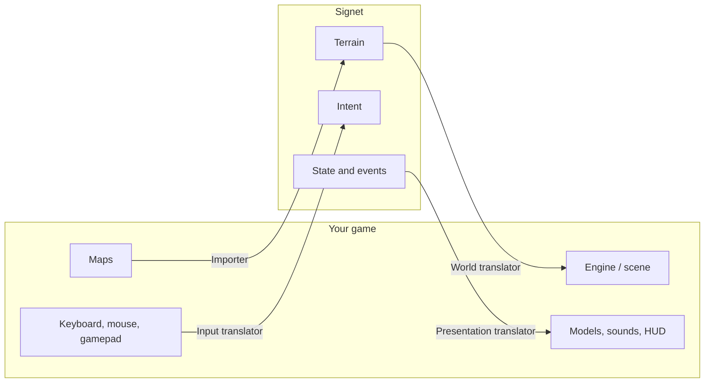

import { Callout } from 'nextra/components'

# Translators

A **translator** is the piece that connects a game to Signet. It has up to four parts, and none of them is mandatory: a game can contribute only maps, only a viewer, or the full package.



| Part | Direction | What it does | Rust interface |
|---|---|---|---|
| **Importer** | game → neutral | converts a map into terrain so a server can host it | `Importador` |
| **World** | neutral → game | builds the game's scene from the terrain | `TraductorMundo` |
| **Input** | game → neutral | converts controls into intent | `TraductorEntrada` |
| **Presentation** | neutral → game | shows bodies and events with the game's assets | `TraductorPresentacion` |

## The beta translators

### Doom (reimplementation)

- **Importer:** reads the player's or the server's WAD, walks the BSP tree and classifies each cell with a point-in-subsector test plus an even-odd check. It opens doors, seals thin walls to avoid leaks and discards isolated spawn points.
- **World:** if the source is `doom:*`, it raises walls from the sidedefs and floors from the subsector polygons. Otherwise it translates the grid with WAD textures.
- **Presentation:** `PLAYA1` and `POSSA1` sprites, `STBAR` status bar, first-person weapons, muzzle flash, red damage screen and WAD sounds.

### OpenArena (reimplementation)

- **Importer:** reads the IBSP v46 map from the `.pk3` files and probes solid brushes in 1 m columns. The floor is the lowest solid surface with 56 free units above it, the ceiling is the next solid surface, and the sky comes from `SURF_SKY`.
- **World:** in native mode it draws the original BSP faces, including polygons, meshes and tessellated Bézier patches, with the lighting baked into the vertices.
- **Presentation:** three-part MD3 models joined by tags, plus weapon, pain and death sounds.

### Minecraft Java (gateway)

- **World:** a local official Minecraft server receives `/fill` commands over RCON and builds columns of blocks. A terrain fingerprint avoids rebuilding it when nothing changed.
- **Input:** it reads the player's position and rotation and steers the neutral body towards them. Right clicks with marked items count as shots.
- **Presentation:** bots are husks and other players are villagers. Events become sounds, particles, damage and chat messages.

### Signet (native)

- **World:** for `signet:*` worlds it draws the full native map: real coloured lights, 3D objects, sky. For any other world it uses the same cell geometry with Signet's generated materials.
- **Presentation:** stylised bodies with a visor that glows in their game's colour (red for bots).

<Callout type="info">
**Native versus translated.** If the map came from the same game as the viewer (`fuente` starts with its prefix), the viewer can load the original from the player's installation, so it looks exactly like the game. Otherwise it translates the neutral terrain. Both paths share the same collision, because collision belongs to the server.
</Callout>

## The translator manifest

Every translator publishes a `signet.json` (in Rust, `Manifiesto`). Launchers and directories read it to know what each player can use:

```json filename="signet.json"
{
  "juego": "openarena",
  "nombre": "OpenArena",
  "version": "0.1.0",
  "protocolo": 1,
  "integracion": "reimplementacion",
  "capacidades": { "importador": true, "mundo": true, "entrada": true, "presentacion": true },
  "modos": ["doom:deathmatch"],
  "requiere": ["baseoa/pak*.pk3 from OpenArena 0.8.8"],
  "licencia": "GPL-2.0"
}
```

Fields: `juego` game id, `nombre` display name, `protocolo` protocol version, `integracion` integration mode (`pasarela` gateway, `motor_abierto` open engine, `mod`, `reimplementacion` reimplementation), `capacidades` which of the four parts it provides, `modos` game modes it can present, `requiere` files it needs from the player, `licencia` the translator's license.

The [conformance suite](/sdk/conformance/) checks the manifest (codes M01–M04) and the terrains the importer produces (T01–T07 and R01–R02).
