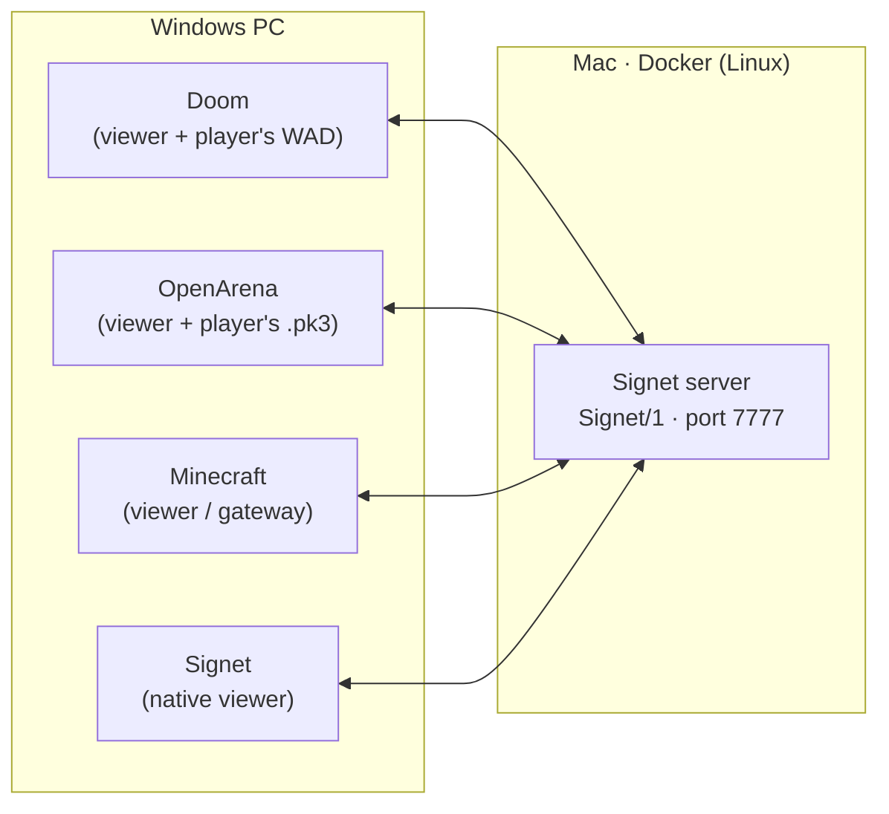

import { Callout } from 'nextra/components'

# Demos

Every screenshot on this page is **real**, taken from beta 0.1 with no retouching. The server runs on a Mac inside Docker (Linux), and the clients run on a Windows PC on the same network. Each game joins through its **translator**: a viewer that reads the player's own files, or a gateway over the original game.

## 1. One match, four games (live)

Four clients connected to the same server at the same time, in the native world **Nexo**, captured at the same moment. All four HUDs show the same player list, one per game: `signet`, `doom`, `openarena` and `minecraft`.

  <figure>
    
    <figcaption><b>Minecraft</b>In the garden, the OpenArena player appears as a block figure with a purple shirt, next to a zombie bot.</figcaption>
  </figure>
  <figure>
    
    <figcaption><b>OpenArena</b>The same garden in OpenArena: two other players, drawn with OpenArena's MD3 models.</figcaption>
  </figure>
  <figure>
    
    <figcaption><b>Signet (native)</b>The temple with its columns and warm lights. On the right, the sync minimap: 0 corrections.</figcaption>
  </figure>
  <figure>
    
    <figcaption><b>Doom</b>The laboratory's toxic channel as Doom nukage, and a crate as a computer pillar.</figcaption>
  </figure>

<Callout type="info">
The minimap on the right (key **M**) shows what the server sees: your body in blue, your prediction in green, bots in red and other players in yellow. After about 200 commands per client: **0 corrections** on all four.
</Callout>

## 2. One native world, every game

**Nexo** is the first [native world](/concepts/native-worlds/). In front of the camera there is a row with one player from each game (Doom, Minecraft, OpenArena and Signet), a bot and a dead bot. It is the same place and the same people, drawn by five engines. The walls and floors come from translating the world; each game provides its own characters.

  <figure>
    
    <figcaption><b>Signet</b>Coloured lights, lamps, arches and the crystal: everything the native world holds. native</figcaption>
  </figure>
  <figure>
    
    <figcaption><b>Doom</b>Players are marines (<code>PLAYA1</code>) and bots are zombies. The crystal becomes a computer panel. translated</figcaption>
  </figure>
  <figure>
    
    <figcaption><b>OpenArena</b>Players are Smarine MD3 models and bots are Sergei. translated</figcaption>
  </figure>
  <figure>
    
    <figcaption><b>Minecraft</b>Block figures wearing the colour of their game. Bots are zombies. translated</figcaption>
  </figure>
  <figure>
    
    <figcaption><b>Neutral view</b>The terrain exactly as the server stores it, with no game on top. neutral</figcaption>
  </figure>

## 3. Other games' worlds, in every game

One game's maps can also be played from the others. The server imports the original map into neutral terrain, and each viewer draws it natively (if it comes from its own game) or translated.

### `openarena:oa_dm1`, an OpenArena map

  <figure>
    
    <figcaption><b>OpenArena</b>The original BSP faces, with Bézier curves and baked lighting. native</figcaption>
  </figure>
  <figure>
    
    <figcaption><b>Doom</b>The Quake III map with Doom textures and sprites. translated</figcaption>
  </figure>
  <figure>
    
    <figcaption><b>Minecraft</b>Stone corridors lit by glowstone. translated</figcaption>
  </figure>
  <figure>
    
    <figcaption><b>Signet</b>The platform's own style, with the terrain's baked lighting. translated</figcaption>
  </figure>

### `doom:E1M1`, the first level of Doom

  <figure>
    
    <figcaption><b>Doom</b>The WAD's original sectors. native</figcaption>
  </figure>
  <figure>
    
    <figcaption><b>OpenArena</b>Doom's hangar with OpenArena textures and models. translated</figcaption>
  </figure>
  <figure>
    
    <figcaption><b>Minecraft</b>Doom's nukage becomes a pool of slime blocks. translated</figcaption>
  </figure>
  <figure>
    
    <figcaption><b>Signet</b>Doom with Signet's materials. translated</figcaption>
  </figure>

## How each game joins

| Game | Translator | Integration mode | Files it uses |
|---|---|---|---|
| Doom | reference Doom viewer | reimplementation | the player's WAD (here, the 1.9 shareware) |
| OpenArena | reference OpenArena viewer | reimplementation | the OpenArena 0.8.8 `.pk3` files (GPL) |
| Minecraft | reference Minecraft viewer **and** a gateway to the official client | reimplementation / gateway | the player's Mojang files / their Minecraft 26.3 |
| Signet | Signet viewer | native | none: generated style |

<Callout type="warning">
**About the Minecraft screenshots.** The ones on this page come from the **reference Minecraft viewer**, which draws with the player's own Mojang files. The **official Minecraft client** joins the match too, through the [gateway](/guides/gateway/), which builds the world on a local server. Its screenshots will come in the next batch, because they require the player's Minecraft account.
</Callout>

## What is next: multi-viewer and multi-graphics

These demos show **multi-game** (four games in one match) and **multi-platform** (server on Mac/Linux, clients on Windows). The next step is to separate the [layers](/concepts/layers/) even further:

| Planned demo | What it will show | Layer |
|---|---|---|
| Minecraft with OpenArena textures | A resource pack generated on the player's PC from their `.pk3` files | appearance |
| Doom with OpenArena models | A viewer mixing one game's engine with another game's characters | appearance |
| `souls:duel` mode in Nexo | Rolling, stamina and lock-on, the same for every game | rules |
| Several viewers at once | Split screen: the same player seen by two games | viewer |

Doom is a trademark of id Software. Minecraft is a trademark of Mojang/Microsoft. OpenArena is a free project (GPL). The screenshots were taken with legitimate copies of each game: the Doom shareware, OpenArena 0.8.8 and the Minecraft files of a personal account. Signet Protocol is not affiliated with any of them.

