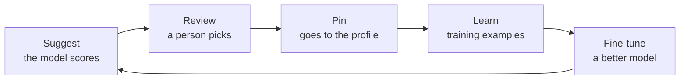

import { Callout } from 'nextra/components'

# Learning and fine-tuning

<Callout type="warning">Draft proposal, part of Signet 2.</Callout>

## The Signet Forge cycle

The fine-tuned model suggests better next time.

Every approved decision is an example: *situation, options, chosen*. With enough examples the model can be fine-tuned for video games. With a model like CLM, which separates a large frozen encoder from two small "heads", only those heads would need training, which should be cheap. This has not been tested yet.

## Data rules

- Only names and identifiers. **Never** game files: no textures, sounds or models.
- Nothing about the player: no usernames and no key logs.
- Contributed under an open license, so the whole community benefits.

## Validate before relying on it

Before a model becomes part of Forge, we will run a small experiment: about 30 cases, comparing hand-written rules, plain text similarity and a contrastive ranker. We will measure top-1 accuracy and how often a person overrides the suggestion. The result decides whether a model adds value.
