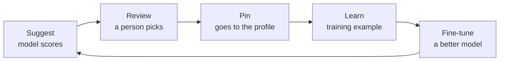

import { Callout } from 'nextra/components'

# Learning and fine-tuning

<Callout type="warning">
Planned behaviour, part of the [Signet 2 proposal](/proposals/translation-profiles/).
</Callout>

Every approved decision is a training example: **situation, candidates, chosen**. With enough of them, a ranking model can be fine-tuned for games, so the next game needs fewer corrections.

With a model like CLM, which keeps a large encoder frozen and trains two small heads on top, only those heads would need training, which should be cheap. This has not been tested yet.

## Data rules

- Only **names and identifiers**. Never game files: no textures, sounds or models.
- Nothing about the player: no usernames, no input logs.
- Contributed under an **open license**, so the whole community benefits.

## Validate before relying on it

Before a model becomes part of Forge, we will run a small experiment: about 30 cases, comparing hand-written rules, plain text similarity and a contrastive ranker, measuring top-1 accuracy and how often a person overrides the suggestion. The result decides whether a model is worth it.
