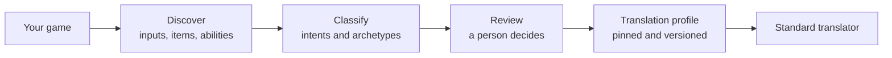

import { Callout, Cards } from 'nextra/components'

# Signet Forge

<Callout type="warning">
**Planned, not released yet.** Signet Forge is part of the [Signet 2 proposal](/proposals/translation-profiles/). This section describes how it is meant to work so the community can shape it. Feedback is welcome in [Discussions](https://github.com/kian-cx/signetprotocol/discussions).
</Callout>

Signet Forge is a **companion tool** for people who build translators. It helps you understand a game, whatever engine it runs on, and turn what you learn into a **translation profile** that the standard Signet translator can use.

You do not need Forge to play. Players only need the standard translator and the profile Forge produced.

## Standard and companion tool

| | Signet Protocol (the standard) | Signet Forge (companion tool) |
|---|---|---|
| **What it is** | Protocol, SDK and the standard translator | An app to create, review and improve translations |
| **Includes** | Intent vocabulary, archetype catalog, capabilities, translation API, profile format, calibration wizard, reference server | Game discovery, suggestion review, profile editing, pending queue, dataset, model fine-tuning |
| **Needed to play?** | Yes | No. Only to build translators |
| **Uses AI?** | Not during a match: it only reads profiles | Yes, to suggest and to train |
| **Goal** | Simple, stable and reliable | Make translations easy to build and better over time |

## What Forge does

1. **Discover** what the game can do: its controls, its items and its abilities.
2. **Classify** each of them against the shared intent vocabulary and archetype catalog. A model suggests, from closed lists only.
3. **Review**: a person confirms or corrects every suggestion.
4. **Pin** the decisions in a translation profile, which works like a lock file.
5. The **standard translator** reads the profile. From then on, the game behaves the same way every time.

<Cards>
  <Cards.Card title="Understanding a game" href="/forge/understanding-a-game/" arrow />
  <Cards.Card title="From suggestion to profile" href="/forge/workflow/" arrow />
  <Cards.Card title="Learning and fine-tuning" href="/forge/fine-tuning/" arrow />
  <Cards.Card title="Signet 2 proposal" href="/proposals/translation-profiles/" arrow />
</Cards>
