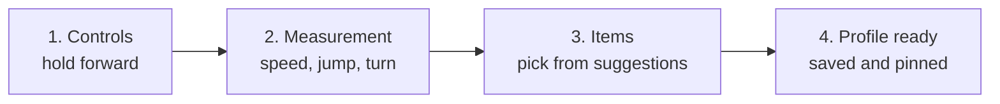

import { Callout } from 'nextra/components'

# Understanding a game

<Callout type="warning">Draft proposal, part of Signet 2.</Callout>

Every engine is different, but every game answers the same three questions. Forge's job is to find those answers and write them down in the shared vocabulary, whatever the game is.

| Question | What Forge produces | Example (Minecraft) |
|---|---|---|
| What can a player **do**? | Intents the game can emit | move, strafe, turn, jump, crouch, fire, use |
| What can **exist** in the world? | Archetypes the game can show | `weapon.ranged`, `weapon.melee`, `health_pickup` |
| What does the game **have** to show them? | The appearance palette | bow, crossbow, fishing rod, golden apple |

Together they become the game's **capabilities**, which the translator declares when it connects. **Review-branch proposal:** a declaration is an offer; the server derives a **negotiated session contract** from the offers, the active semantic profiles and the session requirements. Required unsupported semantics fail admission unless a typed fallback is explicitly allowed. See [Semantic contracts](/proposals/semantic-contracts/).

## Setting up controls in advance (calibration)

Before the first match, the player goes through a short wizard, just like setting up the controls of a new game. This has a huge advantage: **every obvious decision is made by the player themselves, exactly, without using any model.**



1. **Controls.** The wizard asks: "hold the key to move forward for two seconds". It records which key the player used and binds it to the `move` intent. The same for strafing, turning, firing and switching weapons.
2. **Measurement.** For some intents, the wizard **measures** how that game behaves: walking and running speed, jump height, turn speed, eye height, maximum step height. We call this the **motion profile**, and it is what makes the translation faithful.
3. **Items.** For each archetype, the items in the game's palette are shown, with the model's suggestion highlighted. The player accepts it or picks another.
4. **Profile ready.** Everything is saved in the translation profile. From here on, the game works with no ambiguity.

### Three difficulty tiers

| Tier | Examples | How it is solved |
|---|---|---|
| **0 · Obvious** | forward, back, strafe, turn, fire | Set by the player during calibration. **Exact, no model** |
| **1 · Measurable** | run, jump, crouch | Set up and also measured (motion profile). No model |
| **2 · Complex** | abilities, inventory, emotes, vehicles, unusual items | The model **suggests** from closed options and a person **confirms** |

<Callout type="info">
Calibration clears everything obvious out of the way. The model only works on tier 2, where it is actually needed, and the number of decisions it has to make is small.
</Callout>

## Sources Forge can read

Forge only uses sources the game officially allows:

- **The player's own input devices**, during calibration.
- **Open-source engines** and their code.
- **Official mod and plugin APIs**, item registries and data files the game ships for modders.
- **A server you control**, for games with dedicated servers.
- **Documentation and lists you write by hand.**

<Callout type="warning">
Forge does not inject code into online games and does not bypass anti-cheat. A closed game with no legitimate way to read or drive it is out of scope. See the [legal principles](/legal/).
</Callout>

## Building the palette

Forge collects the list of things the game can show (items, weapons, pickups, blocks) from its registry, its mod API or a hand-written list. Each entry gets an identifier and a short description, never the game's files:

```json
{ "id": "minecraft:bow", "describe": "ranged weapon, fires arrows, charged by holding" }
```

## Classifying

For every archetype, Forge asks the resolver to rank the palette. For every complex input, it ranks the intent vocabulary. See [how the model decides](/forge/how-the-model-decides/).

## Recording what the game cannot do

Forge also records **gaps**: intents the game cannot emit (an old game without jumping) or archetypes it cannot show. These gaps are offers, not silent omissions: the session contract marks each one `SUPPORTED`, `SUPPORTED_WITH_FALLBACK`, `OBSERVE_ONLY` or `INCOMPATIBLE`, and a simulation-affecting gap requires an explicit typed fallback instead of a silent approximation. See [Semantic contracts](/proposals/semantic-contracts/).
