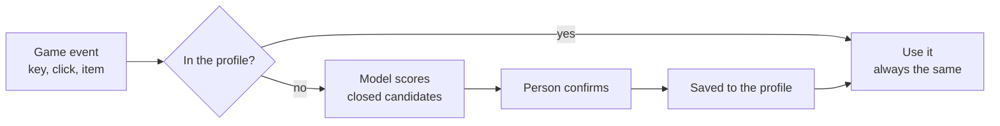

import { Callout } from 'nextra/components'

# From suggestion to profile

<Callout type="warning">
Planned behaviour, part of the [Signet 2 proposal](/proposals/translation-profiles/).
</Callout>

## Decision order



When several sources disagree, the priority is:

1. What the **player** pinned.
2. The translator's **profile**.
3. The **model's** suggestion.
4. A safe **default**.

<Callout type="info">
**The model is never in the game loop.** The server simulates 20 times per second and a model of this size needs a GPU. The model runs in Forge or when something new appears; its answer is saved, and during a match only the profile is read.
</Callout>

## The translation profile

Every decision is stored next to the translator's `signet.json`, like a lock file:

```json
{
  "key": "archetype:weapon.ranged",
  "choice": "minecraft:bow",
  "source": "human",
  "candidates": [["minecraft:bow", 0.81], ["minecraft:crossbow", 0.74], ["minecraft:fishing_rod", 0.22]],
  "resolver": "clm-v0.1-8b",
  "pinned": true
}
```

Because the profile is a text file in git, anyone can improve a translator with a pull request.

## When something is not in the profile

| Policy | Behaviour | For whom |
|---|---|---|
| **Strict** | Ignored. Nothing happens | Tournaments, serious servers |
| **Suggest** | The best candidate is used, marked provisional, and queued for review in Forge | Casual matches |
| **Ask** | Decided on the spot in Forge | Whoever builds the translator |

<Callout type="warning">
**Safety rule:** intents that affect the simulation (moving, firing) must always come from a pinned decision, or client prediction and the server drift apart. Appearance is local to each player and can stay provisional.
</Callout>

## The review queue

Provisional choices made during real matches land in Forge's **review queue**. A person sees the candidates and their scores, picks one, and pins it. The next release of the profile carries the decision to every player.
