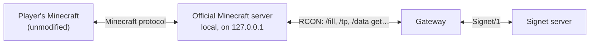

import { Callout } from 'nextra/components'

# Write a gateway

A gateway is a separate program that talks **to Signet on one side and to the game on the other**, using what the game already offers: an official dedicated server, a remote console or a plugin API. The player uses their original, unmodified client.

The beta's Minecraft gateway is the reference example.

## What the Minecraft gateway does

| Direction | How |
|---|---|
| **World** neutral → Minecraft | Builds every column with `/fill` (floor, walls and ceiling) in an empty world. A terrain fingerprint avoids rebuilding it when nothing changed |
| **Input** Minecraft → neutral | Reads the player's position and rotation (`/data get entity`) and steers the neutral body towards them with `Intencion`. Right clicks with marked items are counted with statistic scoreboards |
| **Presentation** neutral → Minecraft | Bots are husks and other players are villagers, moved with `/tp`. `Disparo` (shot) plays a sound and particles, `Danio` (damage) applies `/damage`, `Muerte` (death) uses `/kill` and a message, and the HUD goes in the action bar |
| **Authority** | If the Minecraft body drifts more than 3.5 m horizontally or 2.5 m vertically from the neutral one, the gateway brings it back with `/tp` |

## Lessons learned

- **The game server's rules:** set the ones that interfere. In Minecraft we needed `respawn_radius 0`, because Minecraft scattered players and dropped them on the roof, and difficulty *easy*, because *peaceful* does not allow summoning monsters.
- **Compare height too:** a player standing right above their neutral body, for example on a roof, is not detected with horizontal distance alone.
- **Orphaned processes:** if the gateway starts a game server, it must shut down the previous one when it restarts. Otherwise the world stays locked.

<Callout type="warning">
A gateway should only talk to servers **you control**, such as a local or self-hosted server. Connecting it to third-party official servers, or automating accounts on them, goes against their terms and against our [principles](/legal/).
</Callout>
