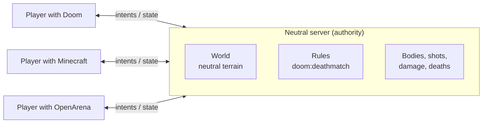

import { Cards } from 'nextra/components'

  <h1>Every game, one world.</h1>
  
Signet Protocol is an open protocol and SDK that lets players with different games join the same world and play the same match. One joins with Doom, another with Minecraft, another with OpenArena, and each of them sees and controls it with their own game.

  

    <a className="mv-boton principal" href="/getting-started/installation/">Get started</a>
    <a className="mv-boton" href="/demos/">See the demos</a>
    <a className="mv-boton" href="/concepts/principle/">How it works</a>
    <a className="mv-boton" href="/protocol/">Signet/1 protocol</a>
  

## How it works, in one picture

A **neutral server** owns the world, the rules and the bodies, and belongs to no game. Every player connects through a **translator**: the piece that converts between the neutral vocabulary and their game.

Only **neutral data** goes over the wire: heights, positions, ids and events such as "shot" or "death". Never a game's files. Each translator draws that world with the textures, models and sounds of **the player's own copy of the game**.

  <figure><figcaption><b>Doom</b></figcaption></figure>
  <figure><figcaption><b>OpenArena</b></figcaption></figure>
  <figure><figcaption><b>Minecraft</b></figcaption></figure>

The same spot of the native world Nexo, with the same players, in three games. More in the <a href="/demos/">demos</a>.

## What already works (beta 0.1)

This is not just an idea: the beta comes out of a working prototype. In a single deathmatch, with 8 bots, these play at the same time:

- **Doom**: a viewer with the original sector geometry, HUD, weapons and sounds from the player's WAD.
- **OpenArena**: a viewer that draws the original BSP maps, with Bézier curves, baked lighting and MD3 models.
- **Minecraft Java**: a gateway that builds the world with blocks on a local official server and translates movement and clicks.
- **Signet**: the platform's own viewer, which draws native Signet worlds with every detail.

The server also hosts **Doom and OpenArena maps** and **native Signet worlds**: a Minecraft player can walk through `oa_dm1` built from blocks while someone else sees it with Doom textures.

<Cards>
  <Cards.Card title="Install the SDK" href="/getting-started/installation/" arrow />
  <Cards.Card title="Your first client in 20 lines" href="/getting-started/first-client/" arrow />
  <Cards.Card title="The five layers: world, rules, viewer, appearance, input" href="/concepts/layers/" arrow />
  <Cards.Card title="Write a translator" href="/guides/write-viewer/" arrow />
</Cards>

## The SDK

| Part | What for | Status |
|---|---|---|
| **Rust** `signet-sdk` | Reference core: protocol, rules, prediction, client, native worlds, translators and conformance | beta |
| **C** `signet.h` | Any engine in C/C++: ioquake3, Doom source ports, Unreal, Godot | beta |
| **C#** `Signet.cs` | Unity and .NET, on top of the C interface | preview |
| **TypeScript** `@signet/sdk` | Bots, observers, directories and web tools | preview |

## Grow it with us

Signet Protocol is open source (Apache-2.0) and gets better with every translator, world and idea. If you like where this is going, a star helps other people find it.

<GitHubStats />

Signet Protocol is not affiliated with id Software, Mojang, Microsoft or the authors of OpenArena. Every game and trademark belongs to its owner.

