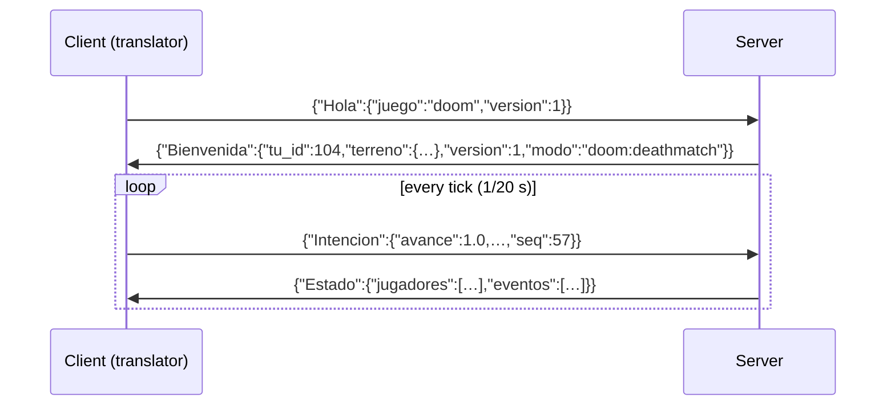

import { Callout } from 'nextra/components'

# Signet/1 protocol

Signet/1 is the common language between servers and translators. It is designed so that any language can speak it without special libraries.

| | |
|---|---|
| **Transport** | TCP, port **7777** by default, `TCP_NODELAY` recommended |
| **Format** | UTF-8 JSON, **one message per line** (terminated by `\n`) |
| **Enumerations** | serde externally tagged: `{"Variant": {fields}}` |
| **Rate** | The server sends one `Estado` per tick (20 per second); the client sends one command per tick |
| **Units** | Metres and radians (see [coordinates](/concepts/neutral-world/#coordinates)) |

<Callout type="info">
**About the vocabulary.** Signet/1 message and field names are in Spanish (`Hola` = hello, `Intencion` = intent, `Estado` = state, `avance` = forward…). They are fixed for compatibility; every field is explained in English in [Messages](/protocol/messages/). An English vocabulary is planned for Signet/2.
</Callout>

## A typical session



1. The client introduces itself with `Hola` (hello) and the name of its game. With `"observador"` (observer) it joins without a body, just to watch.
2. The server answers **once** with `Bienvenida` (welcome): your id, the full terrain, the game mode and, for native worlds, the full map.
3. From then on, the client sends numbered `Intencion` (intent) messages and the server broadcasts `Estado` (state) with every body and the tick's events.

## Try it by hand

Since it is text, you can talk to a server from the terminal:

```bash
# Linux / macOS
printf '{"Hola":{"juego":"observador","version":1}}\n' | nc 192.168.1.212 7777 | head -c 300
```

Continue with the [message reference](/protocol/messages/).
